# llm-wiki Architecture Figure Brief

Use this brief to generate a clean architecture/process diagram similar in spirit
to `assets/architecture.png`, but updated for the current llm-wiki workflow.

## Goal

Create a polished workflow diagram for a personal LLM-maintained research wiki.
The image should communicate that raw research sources are converted into a
durable, linked knowledge base, and that the knowledge base supports an iterative
research loop from ingestion to questions, ideas, experiments, writing, and
review.

## Main Layout

Use a wide landscape canvas with three zones:

1. **Left: Sources**
   - Arrow points from Sources into the central wiki box.
   - Include these source labels:
     - PDFs
     - Zotero library
     - Notes
     - Web pages
     - Crossref metadata

2. **Center: llm-wiki Knowledge Base**
   - Large rounded rectangle labeled `llm-wiki`.
   - Inside the rectangle, use a tidy grid of entity tiles:
     - Papers
     - Concepts
     - Claims
     - People
     - Topics
     - Ideas
     - Experiments
     - Foundations
     - Summaries
     - Graph
   - Under the title or at the bottom of the box, add a small tagline:
     - `Linked markdown + provenance + research graph`
   - Show a preprocessing lane between Sources and the central box:
     - `Zotero lookup`
     - `MinerU PDF → prepared markdown`
     - `Ingest / Reingest`

3. **Right: Outputs**
   - Arrow points from the central wiki box to Outputs.
   - Include these output labels:
     - Answers with citations
     - Literature maps
     - Paper drafts
     - Experiment plans
     - Review reports
     - Rebuttals

## Top Research Loop

Above the central wiki box, draw a circular or semicircular loop with arrows:

`Ingest → Ask → Discover → Ideate → Design Experiment → Evaluate → Write → Review → Reingest`

The loop should feel like a continuous research cycle, not a linear pipeline.
The central wiki box should appear to power and remember every step.

## Visual Style

- Clean academic diagram, not a marketing hero image.
- White or very light background.
- Dark navy text and arrows.
- One warm accent color for the central box border and small arrow markers.
- Use simple line icons if possible:
  - document for Papers
  - lightbulb for Ideas
  - check bubble for Claims
  - graph/network for Graph
  - flask or instrument for Experiments
  - user silhouettes for People
  - globe or folder for Topics
  - book for Foundations
- Keep typography clear and readable.
- Avoid dense paragraphs inside the image.
- Do not include `.arXiv` as a source label.
- Do not mention `LLMWiki` as the product name; this repo should be labeled
  `llm-wiki`.

## Optional Caption

`Knowledge compiled once, linked with evidence, and reused across research workflows.`

## Mermaid Reference

This is only a structural reference for the image generator; the final image
should be an illustrated architecture diagram, not a raw Mermaid rendering.

```mermaid
flowchart LR
  subgraph Sources
    PDF[PDFs]
    Zotero[Zotero library]
    Notes[Notes]
    Web[Web pages]
    Crossref[Crossref metadata]
  end

  subgraph Prep[Source preparation]
    Lookup[Zotero lookup]
    MinerU[MinerU PDF to prepared markdown]
    Ingest[Ingest / Reingest]
  end

  subgraph Wiki[llm-wiki Knowledge Base]
    Papers[Papers]
    Concepts[Concepts]
    Claims[Claims]
    People[People]
    Topics[Topics]
    Ideas[Ideas]
    Experiments[Experiments]
    Foundations[Foundations]
    Summaries[Summaries]
    Graph[Graph]
  end

  subgraph Outputs
    Answers[Answers with citations]
    Maps[Literature maps]
    Drafts[Paper drafts]
    Plans[Experiment plans]
    Reviews[Review reports]
    Rebuttals[Rebuttals]
  end

  Sources --> Prep --> Wiki --> Outputs
  Wiki --> Ask[Ask]
  Ask --> Discover[Discover]
  Discover --> Ideate[Ideate]
  Ideate --> Design[Design Experiment]
  Design --> Evaluate[Evaluate]
  Evaluate --> Write[Write]
  Write --> Review[Review]
  Review --> Ingest
```

